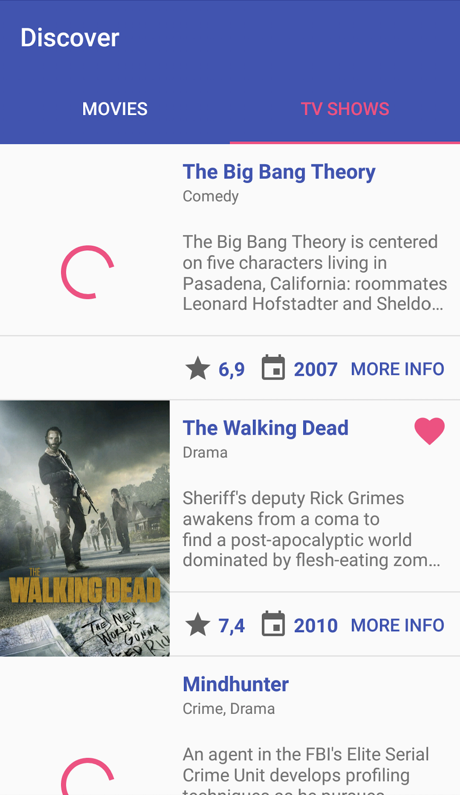

# Discover
An application for android that displays information about the popular movies from The Movie Database. To achieve that, the application is designed with a clean architecture approach, separating the project into different layers: Views (with an MVP model), domain and data. In addition, the app also use libraries or patterns widely used.

# Application example views

## Main view
> Where you can choose to see the list of movies or tv shows. You are able to scroll down and select the movie which you want to see detailed information from.

## Tv Show detailed information

## Tv Show picture animation

## Tv Show detailed information

